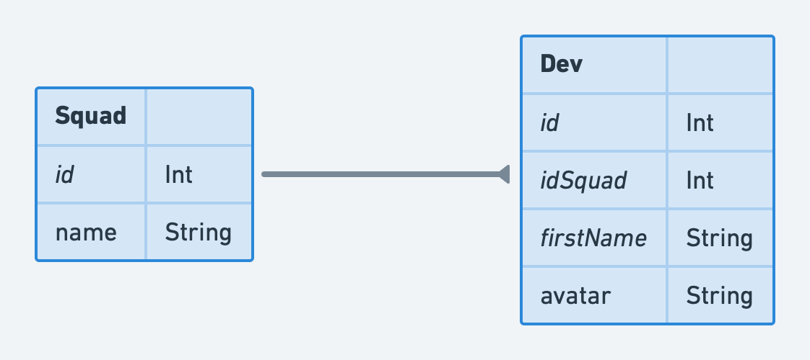

# DevFriends bootstrapper

Here is a project based on nextjs and material-ui to toy a bit with react.

<!-- readme-package-icons start -->

&nbsp;&nbsp;&nbsp;&nbsp;&nbsp;&nbsp;&nbsp;&nbsp;&nbsp;&nbsp;&nbsp;

<!-- readme-package-icons end -->

## ⚡ Advices

- Do not hesitate to use react ecosystem to answer our needs. There is no limitation.
- Our application is using [material-ui](https://mui.com/material-ui/getting-started/overview/). Take advantage of the documentation to get working code from examples.

## ⚡ Case study

Your new boss comes at your desk today. He says there is a lot of devs in the team right now, and each one of them is assigned to a squad. But he cannot keep up with who is in which squad.

He wants you to make an app allowing him to see developers and filter them by squad. Then, once you're done, he may come back to ask you for something extra: the ability to move a dev to another squad.

### 🔶 Step 1 : Displaying developers

We can begin by getting developers from our backend and display them. Remember there is no restriction on what we may use in the react ecosystem!

### 🔶 Step 2 : Adding a filter to display only the developers of one or several squads

The next step is to add a filter component. This could be checkboxes or a multiselect for example.

### 🔶 Step 3 : Change the squad of a developer

Finally, we need to give a way to change the squad of a developer. This could be done on a new page or in a modal, for example.

## ⚡ Data model

Our backend is plugged to a database with the following schema:

## ⚡ Exposed routes

Our backend exposes a swagger found [here](https://devfriends-backend.fly.dev). Let's summarizes the routes exposed:

| Route                 | Verb    | Description                                                             |
| --------------------- | ------- | ----------------------------------------------------------------------- |
| 💥 /squads            | 🔹 GET  | Retrieves all squads                                                    |
| 💥 /squads/{id}/devs  | 🔹 GET  | Retrieves all devs belonging to a squad                                 |
| 💥 /devs              | 🔹 GET  | Retrieves all devs                                                      |
| 💥 /devs/by-squad     | 🔸 POST | Retrieves devs belonging to a list of squads passed in the request body |
| 💥 /devs/change-squad | 🔸 POST | Moves a developer to another squad                                      |
